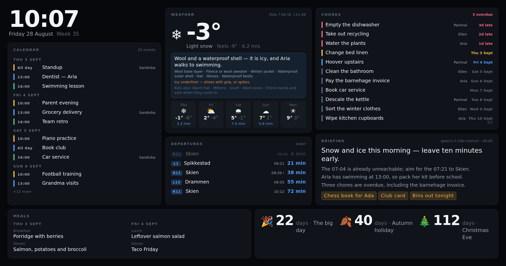

# Family Dashboard

A self-hosted wall dashboard for a television or a spare monitor. It shows the
family calendar, the weather and what to wear for it, public-transport departures,
the chore list, the meal plan, and a short daily briefing written by a language
model you run yourself.



It is built around one idea: **a component is a folder.** Drop a folder into
`components/`, and it appears on the board. Delete the folder and it is gone.
There is no registry to edit and no plugin lifecycle to learn.

## What makes it different

- **Nothing scrolls.** A wall display has no keyboard and nobody standing close
  enough to reach it, so lists measure the space they have and either fit or page
  through it. A scrollbar would be content nobody can ever read.
- **Readable from the sofa.** Every size derives from one root font size, so the
  whole board scales to your screen and viewing distance from a single value. A
  test asserts nothing renders below 28px at 4K.
- **Your local services stay local.** The server talks to Mealie, Donetick and
  your language model; the browser only ever talks to the server. Tokens never
  reach the page.
- **It keeps working when things break.** A failed refresh never blanks a panel —
  it keeps the last good data behind a small staleness dot.
- **No CDN.** Fonts, icons and scripts are all served locally, so the board renders
  correctly when the internet is down.

## Components included

| Component | What it shows | Needs |
| --- | --- | --- |
| `clock` | Time, date, ISO week | nothing |
| `weather-yr` | Conditions and 5-day forecast from met.no, plus what to wear | nothing |
| `calendar-ics` | Any number of iCal feeds merged and colour-coded | calendar URLs |
| `entur` | Norwegian public-transport departures | nothing |
| `mealie` | Today's and tomorrow's meal plan | a Mealie instance |
| `donetick` | Household chores, overdue first | a Donetick instance |
| `countdown` | Days until dates you care about | nothing |
| `ai-briefing` | A short daily briefing joining all of the above | an LLM endpoint |

Every one is optional. A component with no configuration hides itself instead of
showing an error, so you can bring them online one at a time.

## Quick start

```bash
git clone https://github.com/parimaln/dashboard.git
cd dashboard

cp .env.example .env                              # fill in what you have
cp config/public.example.json config/public.json  # your location and layout
cp config/household.example.md config/household.md  # optional, for the briefing

npm install
npm run dev
```

Open <http://localhost:5173>. Nothing is configured yet, so you get a setup screen
listing what each component is waiting for.

To see the full board immediately without configuring anything:

```bash
npm run build && MOCK=1 npm start   # http://localhost:8080, fixture data
```

For a permanent install, run the container on the same machine as your other
services — see **[docs/INSTALL.md](docs/INSTALL.md)**.

## Documentation

| | |
| --- | --- |
| [INSTALL.md](docs/INSTALL.md) | Running it for real: Docker, updates, why it must be self-hosted |
| [CONFIGURATION.md](docs/CONFIGURATION.md) | Layout, settings, and every environment variable |
| [COMPONENTS.md](docs/COMPONENTS.md) | Changing a component, and writing a new one |
| [DISPLAY.md](docs/DISPLAY.md) | Screen sizes, scaling, overscan, kiosk setup |
| [AI.md](docs/AI.md) | Choosing a model, editing the prompt, the household notes |
| [AUTOMATION.md](docs/AUTOMATION.md) | Turning the display on and off by voice |

## Licence

MIT. See [LICENSE](LICENSE).
